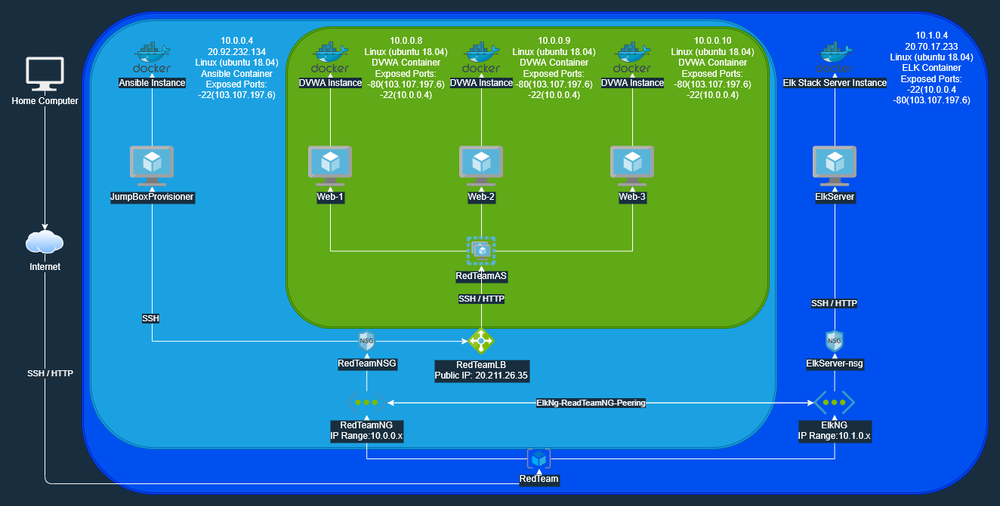
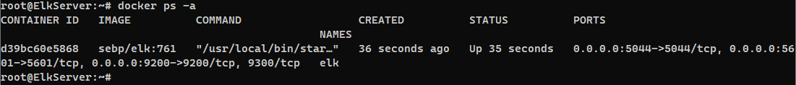

# CyberXSecurity-Project-1
## **_Damn Vulnerbale Web Application_**
### 18/02/2022

The files in this repository were used to configure the network depicted below.

These files have been tested and used to generate a live ELK deployment on Azure. They can be used to either recreate the entire deployment pictured above. Alternatively, select portions of the Complete_Install.yml file may be used to install only certain pieces of it, such as Filebeat.

  - [Complete_Install.yml](Scripts/Complete_Install.yml)

This document contains the following details:
- Description of the Topologu
- Access Policies
- ELK Configuration
  - Beats in Use
  - Machines Being Monitored
- How to Use the Ansible Build

### Description of the Topology

The main purpose of this network is to expose a load-balanced and monitored instance of DVWA, the **_Damn_ Vulnerable Web Application**.

Load balancing ensures that the application will be highly Available, in addition to restricting Access to the network.
- The load balancer is behind a network security group that allows direct control over public network connections. This also allows the user the ability to control the webservers themselves through a jumpbox which is only accessible through a limited IP range associated with the administartors computer.

Integrating an ELK server allows users to easily monitor the vulnerable VMs for changes to the machine and system containers.
- **FileBeat**, an intergrated part of the ELK Stack, allows admins to directly gather logs from the systems running its client and manipulate the logs to gather vital data about the operations taking place on the system and look for potentially fraudulent or mal-intent actors. 
- **MetricBeat**, also part of the ELK Stack, allows amdins to monitor the funtioning and helth of the machines by looking at performance metricks from the network and hardware. This allows the admins to both see the capacity and flow of traffic but also if the servers are in need of maintance or increased capacity.

The configuration details of each machine may be found below.

|     **_Name_**     | **_Function_** | **_IP Address_** | **_Operating System_** |
|:------------------:|:--------------:|:----------------:|:----------------------:|
| JumpBoxProvisioner | Gateway        | 10.0.0.1         | Linux (ubuntu 18.04)   |
|        Web-1       | Host Server    | 10.0.0.8         | Linux (ubuntu 18.04)   |
|        Web-2       | Host Server    | 10.0.0.9         | Linux (ubuntu 18.04)   |
|        Web-3       | Host Server    | 10.0.0.10        | Linux (ubuntu 18.04)   |
|      ElkServer     | Log Server     | 10.1.0.4         | Linux (ubuntu 18.04)   |

### Access Policies

The machines on the internal network are not exposed to the public Internet. 

Only the JumpBox machine can accept connections from the Internet. Access to this machine is only allowed from the following IP addresses:
- 103.107.197.6 - Proxy end point of VPN

Machines within the network can only be accessed by JumpBox and ELKServer.
- A summary of the access policies in place can be found in the table below.

|      **Name**      | **Publicly Accessible** | **Allowed IP Addresses** |
|:------------------:|:-----------------------:|:------------------------:|
| JumpBoxProvisioner |           Yes           |       103.107.197.6      |
|        Web-1       |            No           |         10.0.0.4         |
|        Web-2       |            No           |         10.0.0.4         |
|        Web-3       |            No           |         10.0.0.4         |
|      ElkSever      |           Yes           |  103.107.197.6, 10.0.0.4 |

### Elk Configuration

Ansible was used to automate configuration of the ELK machine. No configuration was performed manually, which is advantageous because this allows the deploymeny of this software accross a hypothetically infinite network. It also advantages us as we can also uninstall and update using the same process through ansible, making maintanance and disposale significanlty easier.

The playbook implements the following tasks:
- Install Docker.io
- Install python3-pip
- Install Docker pip Library
- Enable the Docker Serive
- Download and setup the ELK container

The following screenshot displays the result of running `docker ps` after successfully configuring the ELK instance.

### Target Machines & Beats
This ELK server is configured to monitor the following machines:
- 10.0.0.8
- 10.0.0.9
- 10.0.0.10

We have installed the following Beats on these machines:
- FileBeat
- MetricBeat

These Beats allow us to collect the following information from each machine:
- Filebeat collects all logs on machines it is connected to:
  -For Example, the logs from user logons of Connected Ip's.
- Metricbeat collects all hardware information for the servers it is connected to:
  -For Example, the dosk usage and capacity or the network throughput.

### Using the Playbook
In order to use the playbook, you will need to have an Ansible control node already configured. Assuming you have such a control node provisioned: 

SSH into the control node and follow the steps below:
- Copy the [Complete_Install.yml](Scripts/Complete_Install.yml) file to the ansible container.
- Copy the [filebeat_config.yml](Scripts/filebeat_config.yml) file to the ansible container.
- Copy the [metricbeat_config.yml](Scripts/metricbeat_config.yml) file to the ansible container.
- Update the [filebeat_config.yml](Scripts/filebeat_config.yml) file to include:
  - Scroll to line #1106 and replace the IP address with the IP address of your ELK machine.
    - Replace the IP Address with your own.
    - Replace the username with your own.
    - Replace the password with your own.
  - Scroll to line #1806
    - Replace the IP address with the IP address of your ELK machine.
- Update the [metricbeat_config.yml](Scripts/metricbeat_config.yml) file to include:
  - Scroll to line #93
    - Replace the IP Address with your own.
    - Replace the username with your own.
    - Replace the password with your own.
  - Scroll to line #61
    - Replace the IP address with the IP address of your ELK machine.
- Update the [Complete_Install.yml](Scripts/Complete_Install.yml) file so that the directories for the config files match the sources address in the ansible container:
  - Line 79: Filebeat config location
  - Line 105: Metricbeat config location
  - Line 113: Metricbeat docker config location
- Run the playbook, and navigate to the end of the command line to check that the installation worked as expected.

- To update the allow ansible to connect to specific servers you must edit the hosts file in the /etc/ansible/ directory. To add a machine type its public or private IP address, and to add an new host group, write the name you wish to call your host group and encase it in sqaure brackets i.e.([]).
- Ensure that the name you have given each server group matches that in the [Complete_Install.yml](Scripts/Complete_Install.yml) file under the hosts dection in lines 4 and 66.
- To navigate to your Elk server please find the servers public ip through the server hosting provider i.e.(Azure) and replace it in the specified part of the url below.
  -  http://[YourVMIP]:5601/app/kibana.

###Command line Install
To simplify the process please run the commands below to automatically install and configure the systems
- mkdir ELK_Stack_Install && cd ELK_Stack_Install
- wget --no-check-certificate --content-disposition -O Complete_Install.yml https://raw.githubusercontent.com/Logicye/CyberXSecurity-Project-1/main/Scripts/Complete_Install.yml
- wget --no-check-certificate --content-disposition -O filebeat-config.yml https://raw.githubusercontent.com/Logicye/CyberXSecurity-Project-1/main/Scripts/FileBeat/filebeat-config.yml
- wget --no-check-certificate --content-disposition -O metricbeat-config.yml https://raw.githubusercontent.com/Logicye/CyberXSecurity-Project-1/main/Scripts/MetricBeat/metricbeat-config.yml
- wget --no-check-certificate --content-disposition -O metricbeat-docker-config.yml https://raw.githubusercontent.com/Logicye/CyberXSecurity-Project-1/main/Scripts/MetricBeat/metricbeat-docker-config.yml
- **To edit file configs see steps above**
- ansible-playbook Complete_Install.yml

### Bash File Install
- wget -O Complete_Install https://raw.githubusercontent.com/Logicye/CyberXSecurity-Project-1/main/Scripts/Complete_Install.sh && chmod u+x Complete_Install && chmod 777 Complete_Install && sudo mv Complete_Install /bin && sudo Complete_Install
- Follow the steps in the installer to configer and install the elk stack and it's dependecies.

